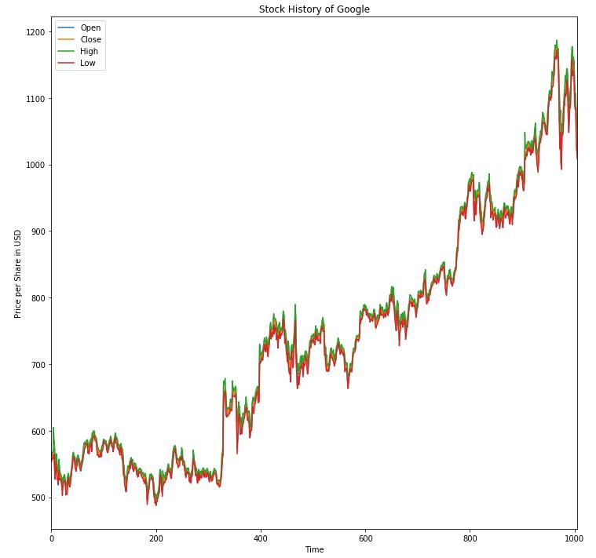
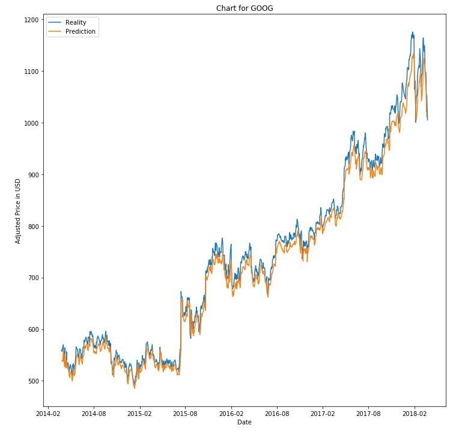

# Documentation

This markdown file is provided as a single point of information for several questions. 
Most of them are provided within the different files, e.g. documentation of code in the modules.
However, as the repository gets bigger with each commit, I try to give a good overall overview 
additionally to the README for this project.

## Table of Contents

- [1. Project Definition](#1-project-definition)
  * [1.1 High Level Overview](#11-high-level-overview)
  * [1.2 The Problem](#12-the-problem)
  * [1.3 Metrics](#13-metrics)
- [2. Analysis](#2-analysis)
  * [2.1 Features](#21-features)
  * [2.2 Data Visualizations](#22-data-visualizations)
- [3. Methodology](#3-methodology)
  * [3.1 Preprocessing Steps](#31-preprocessing-steps)
  * [3.2 Implementation](#32-implementation)
  * [3.3 Model results](#33-model-results)
- [4. Results](#4-results)
  * [4.1 Testing the results](#41-testing-the-results)
  * [4.2 Discussion](#42-discussion)
- [5. Conclusion](#5-conclusion)
  * [5.1 The end-to-end problem](#51-the-end-to-end-problem)
  * [5.2 Improving the application](#52-improving-the-application)

---

## 1. Project Definition

### 1.1 High Level Overview
Being able to predict the future of a companies performance is a dream for many data scientists and business analysts.
It's known to be an extremely complicated problem, as there are so many (hidden or known) variables which have an input
for the stock prices. Some ideas for possible features are:
- the performance of the company measured in past financial data (bilance sheets, OHLC-data, ...)
- sentiment analysis in social media for the products of the company or the general opinion at the moment
- what famous & important people say about the company
- trends in development
- trends for industries
- ...
  
This repository contains code and data for a **overly-simplified** Stock Price Predictor for the S&P 500 Index.
The goal is to develop a web-application which offers a little user interface, where the user can input some stock
data (=symbols like 'GOOG' or 'AMZN') and get predicted prices for the next day. The result by now is shown in the 
following screenshot:  
  

  
The goal of this project is to develop a simple prototype which gives me some ideas how to further develop and optimize
a potential application, e.g. in functionality. Additionally, I not only wanted to create the application as a prototype,
but furthermore as a baseline for future development. More on this in the next sections.   

The S&P 500 Predictor consists of hundreds of artificial neural networks, one for each stock (that was able to perform well
enough, bad models were excluded).

### 1.2 The Problem
As already mentioned, the goal is to create a model which is able to predict "well" on future performances of companies 
based on some data. The problem I'm facing during developing the application is to get to a point where I can say with
a certain confidence, that the model is good enough to predict prices which will lead to profitable results when used
as a trading engine. **Right now, the problem isn't solved - I wouldn't recommend to use the model as a predictor for future
prices, even though it performs well on past data**. The model simply isn't facing all the variance that occurs when predicting
future performances (as I'm only including a few financial features). However, as this was meant to be a prototype/baseline, 
I can say that I'm pleased with the results by now :)

### 1.3 Metrics
To measure the performance of the models, the [RMSE](http://statweb.stanford.edu/~susan/courses/s60/split/node60.html) 
metric is used. RMSE stands for the Root Mean Squarred Error, a metric which is used to calculate the performance of
regression models by first calculating the squarred error of a prediction (-> SE), then taking the mean over the (batch of) data 
(-> MSE), and finally calculating the Root to compensate the square (-> RMSE). The advantage of this metric is that it is 
able to punish big errors much more than large errors, and I definitely want to avoid big errors when predicting stock prices!
If you want to get further details, I recommend the following medium article: 
[MAE and RMSE — Which Metric is Better?](https://medium.com/human-in-a-machine-world/mae-and-rmse-which-metric-is-better-e60ac3bde13d)

--- 

## 2. Analysis

### 2.1 Features
The Features used for Stock Price Prediction are the following:
- Date: day of the observation
- Open: price of the share at opening of the stock market ("first value of the day")
- High: highest price of the share during the day
- Low: lowest price of the share during the day
- Close: price of the share when the stock market closed ("last value of the day")
- Ex-Dividend: time period between the announcement and payment of a dividend
- Split-Ratio: the ratio of shares outstanding compared to what was originally available before a stock split (i.e. when 
Amazon doubled it's amount of shares, as a consequence the prices had to be adjusted)
- Adjusted Open (High, Low, Close): adjusted price after split
- Volume: amount of shares traded that day

The target is the Adjusted Close for the next day.

### 2.2 Data Visualizations
Example Stock History for Google:
  
This image shows the how the stock price changed for Google shares; the different colors (which are honestly hard to differentiate)
show the difference in Open, High, Low and Close.

The model's goal is to predict a price for the next day given the today's feature values. Acting as if we tried to predict
future values in the past (kind of time-travelling ;) ), the (Google) model is able to perform quite well:
  
Of course this shouldn't be accepted without any critical considerations. Looking closely at the image, we can see that the 
predictions are good, but always a little "too late" (the orange graph is following the blue one). Therefore, the model can be used
to predict values given that there is a momentum (the model is able to see that high prices today will most likely lead
to high prices tomorrow etc.). What the model most likely won't detect is a crisis, a rapid fall of the prices!  
Still, I believe that this prototype has potential to be used as a baseline - enriching the data with social media content etc.
it might be possible to "move" the predictions a little to the left on the x-axis (which means we'd actually be able to
build predictions of the performance).

---

## 3. Methodology

### 3.1 Preprocessing Steps
The data is being collected via the Quandl API. A Script calls the API-url for every one of the 500+ companies which
exist in the Index. The Dates have to be transformed from Strings to Datetime Objects. The target value (Adjusted Close
price for the next day) needs to be read from the following row. As each column is numerical, the data can directly be
scaled and stored. 

### 3.2 Implementation
After the models have been trained, only those with a "good" performance (RMSE value is low in relation
to the stock prices for this company's share) get selected to be used in the S&P500 Predictor. The S&P500 Predictor is
a Wrapper for all the models that have been trained; Whenever we want to get a prediction for a stock price, we can use
the Predictor to call the underlying company model with todays values as input features.

The S&P 500 Predictor Prototype is build inside of a very little [Django](https://www.djangoproject.com/) 
Web Application. Therefore the predictor can be accessed via a GUI. The result will be displayed in a table,
additionally a visualization of the model on past data will be shown using Chart.js (see above).

### 3.3 Model results
Roughly half of the trained models predict very well on past data.

---

## 4. Results

### 4.1 Testing the results

### 4.2 Discussion

---

## 5. Conclusion

### 5.1 The end-to-end problem

### 5.2 Improving the application