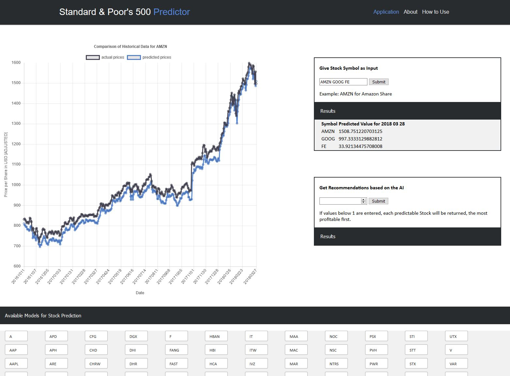
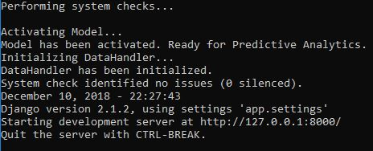
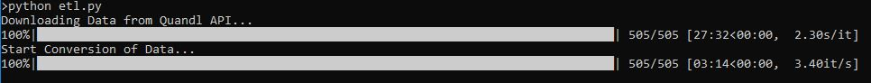
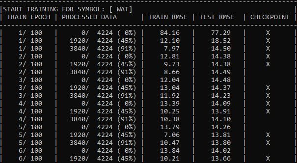
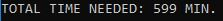

# Stock-Price-Prediction
This Repository contains the application for the Capstone Project of
Udacity's Data Scientist Nanodegree Program. The result (by now) is an application which 
is able to provide stock price predictions for many of the Companies which are included 
in the [S&P 500 Index](https://eu.spindices.com/indices/equity/sp-500).

  

**Further Information about the Project itself can be found in the DOCUMENTATION.md File!**

If you've got any questions, feel free to contact me: johannes.hoetter@smail.inf.h-brs.de

##  Table of Contents
- [1. Project Motivation](#1-project-motivation)
- [2. How I developed the model and how its performance gets evaluated](#2-how-i-developed-the-model-and-how-its-performance-gets-evaluated)
- [3. Installation - only tested on Windows 10!](#3-installation---only-tested-on-windows-10-)
    + [3.1 Install dependencies in a virtual environment](#31-install-dependencies-in-a-virtual-environment)
    + [3.2 Run the Server](#32-run-the-server)
- [4. How to Use](#4-how-to-use)
- [5. Recommendations](#5-recommendations)
- [6. File Descriptions](#6-file-descriptions)
- [7. Technologies used](#7-technologies-used)
- [8. Acknowledgements](#8-acknowledgements)

---

### 1. Project Motivation
In the last project, we were allowed to follow
a topic we find interesting ourselves. As I'm interested in financial topics, I 
thought it would be interesting to develop a little prototype for a Stock Price Prediction.
The motivation was not to build a perfectly fine Stock Price Predictor which will make me 
rich in no time. The data I collected simply doesn't contain the complete complexity of
the whole finance market. However, for some stocks my model collection was able to predict
good prices! Therefore I'm going to continue developing on this project.  
The main motivation was to start a whole "app-development" project from scratch. I had to
think about how and where I get my data from, whether I need to do a lot of conversion or 
cleansing, what kind of structure my model needs to have, how I develop the app as a whole, ... 
(the list goes on).  
I definitely learned a ton during this project even though the result is far away from perfect!
As I said, I'm going to continue working on this application. The improvements I already have in my mind are
for example using the Twitter API to do a sentiment analysis which "explains" the model whether the company did
well in media or not. Another option would be to use in some way the Wall Street Journal, as there must be some really
interesting facts which I haven't considered so far. Additionally, I could enrich the data with balance sheet data. 
There definitely are so many ways to continue this project! :)

### 2. How I developed the model and how its performance gets evaluated
The data I used comes from the [Quandl API](https://www.quandl.com/). I used basic financial data such as 
**Open-High-Low-Close** Data for each Stock Symbol. I tried to predict the (adjusted) Close value of the stock 
for the next day given on the OHLC data from the current day. This is the most obvious straight-forward way, 
and I'm thinking about whether there are possibilities to improve this. But for now, this is what the model learns.  
I evaluated the performance of each model by calculating the 
[Root Mean Squared Error](http://statweb.stanford.edu/~susan/courses/s60/split/node60.html) for the predictions.
Those models, which got a RMSE which is low in comparison to the stock price gets used in the SP500 Predictor; this way,
no models which performed poorly are being used in the SP500 Predictor.  
If you want to get a better understanding of how I developed the scripts, take a look at the .ipynb files in the project 
directory. They show how i encapsulated cells and why I decided in certain ways.


### 3. Installation - only tested on Windows 10!
To install this project, I'd recommend using Anaconda for virtual environments.
There are several requirements (installed libraries) which your machine needs to have in
order to run the application. I've provided a **requirements.txt** file which contains
all of the dependencies except for **PyTorch**, which you'll have to **install manually**.

##### 3.1 Install dependencies in a virtual environment
If you've got Anaconda installed, do the following to be able to run the application:
1. Clone or Download the Repository onto your local machine.
2. If you downloaded the Repository, unzip the files.
3. Open a new Anaconda Prompt Shell and navigate to the project (SP500-Prediction).
4. Create a new virtual environment typing the following: <br>
`conda env create --name sp500 --file requirements.txt`.  
 After that, you'll have installed 
most of the needed dependencies automatically.
5. To install the last dependency, do the following:   
`activate sp500`  
`conda install pytorch-cpu torchvision-cpu -c pytorch`
6. Now you have all the dependencies installed. It's time to get the server up and running!

##### 3.2 Run the Server
If you're in the SP500 Order in the Shell (e.g. Anaconda Prompt), change the directory to 
the app folder (`cd app`). From there, type the following:  
`python manage.py runserver`.  
**Caution, Known Bug!** It occured to me many times that the system didn't find the manage.py file at first.
If this happens to you too, chances are that you have to retry (most of the cases it works directly, but don't
be surprised if you need to start the server 5 times.. I'll try to fix this one as soon as possible, if possible).  
The localhost will be used to run the application, so you can access the application using the given url (in the screenshot
below it's localhost:8000)  
  
Have fun trying out the prototype :)

### 4. How to Use
There are mainly three things you can do with the scripts of this repository:
1. Download, transform and store finance data using the [Quandl API](https://www.quandl.com/). For this, enter the
path where the etl.py script lies (app/ml_predictor/tools) and then type into your console `python etl.py`.  

2. Train machine learning models using. For this, enter the path where the model_development.py script lies 
(app/ml_predictor/machine_learning) and type into your console `python model_development.py`.   
  
**Caution**: This can 
and will take up to several hours depending on your machine - there are roughly 500 models which get trained, each of
those for 50 epochs; for you to be able to start the application right away, I've already included all the models in 
this repository, so that you don't have to run either of the first two steps. However, if you want to, you can of course.  
   
In the future, I'm going to add some parameters to both scripts, so that you can easily decide whether you want to train all models,
for which time etc. Right now, you have to use the whole script :)
3. Run the server (see above, 2.2 Run the Server). 

### 5. Recommendations
For proper usage of the application, I'd recommend a window width of 1300px or above (in Chrome, press F12 to see the size of the browser).  
I didn't include any files by now that make the application responsive, therefore it's best to use it in fullscreen format on a notebook or so.

### 6. File Descriptions
```
-SP500-Stock-Price-Prediction
    |
    |- app
    |   |
    |   |- app
    |   |   |
    |   |   |- __init__.py
    |   |   |- settings.py
    |   |   |- urls.py
    |   |   |- wsgi.py
    |   |
    |   |- ml_predictor
    |   |   |
    |   |   |- data
    |   |   |   |
    |   |   |   |- cleaned
    |   |   |   |   |
    |   |   |   |   |- all stock data in a db (not contained in repo because of size!)
    |   |   |   |
    |   |   |   |- ml_format
    |   |   |   |   |
    |   |   |   |   |- all stock data in a .npz format
    |   |   |   |
    |   |   |   | - raw
    |   |   |   |   |
    |   |   |   |   |- all stock data as .csv files
    |   |   |   |
    |   |   |   | - Data_Exploration.ipynb
    |   |   |   
    |   |   |- machine_learning
    |   |   |   |
    |   |   |   |- archive
    |   |   |   |
    |   |   |   |- models
    |   |   |   |   |
    |   |   |   |   |- all models (as .pth files)
    |   |   |   |
    |   |   |   |- sp500
    |   |   |   |   |
    |   |   |   |   |- sp500 model as .pth file
    |   |   |   |
    |   |   |   |- stats
    |   |   |   |   |
    |   |   |   |   |- training_stats.p
    |   |   |   |
    |   |   |   |- __init__.py
    |   |   |   |- ml_tools.py
    |   |   |   |- model_development.py
    |   |   |   |- Model_Development_Dev.ipynb
    |   |   |   |- neuralnet.py
    |   |   |   |- NeuralNet_Dev.ipynb
    |   |   |   |- sp500.py
    |   |   |   |- SP500Model_Dve.ipynb
    |   |   |   
    |   |   |- tools
    |   |   |   |
    |   |   |   |- archive
    |   |   |   |
    |   |   |   |- serialized_tool_objects
    |   |   |   |   |
    |   |   |   |   |- dataconverter.p
    |   |   |   |   |- datahandler.p
    |   |   |   |   |- stockdatacrawler.p
    |   |   |   |
    |   |   |   |- __init__.py
    |   |   |   |- data_converter.py
    |   |   |   |- data_handler.py
    |   |   |   |- DataConverter_Dev.ipynb
    |   |   |   |- DataHandler_Dev.ipynb
    |   |   |   |- etl.py
    |   |   |   |- ETLScript_Dev.ipynb
    |   |   |   |- StockDataCrawler_Dev.ipynb
    |   |   |   |- web_crawler.py
    |   |   |   
    |   |   |- __init__.py
    |   |
    |   |- sp500predictor
    |   |   |
    |   |   |- migrations
    |   |   |   |
    |   |   |   |- __init__.py
    |   |   |   
    |   |   |- static
    |   |   |   |
    |   |   |   |- css
    |   |   |   |   |
    |   |   |   |   |- index.css
    |   |   |   |
    |   |   |   |- javascript
    |   |   |   |   |
    |   |   |   |   |- collapse.js
    |   |   |   |   |- multiple_column_lists.js
    |   |   |   |   |- sticky_header.js
    |   |   |   
    |   |   |- templates
    |   |   |   |
    |   |   |   |- sp500predictor
    |   |   |   |   |
    |   |   |   |   |- includes
    |   |   |   |   |- index.html
    |   |   |   
    |   |   |- __init__.py
    |   |   |- admin.py
    |   |   |- apps.py
    |   |   |- forms.py
    |   |   |- models.py
    |   |   |- tests.py
    |   |   |- urls.py
    |   |   |- views.py
    |   |   
    |   |- manage.py
    |   |- requirements.txt
    |   
    |- images
    |   |
    |   |- etl.jpg
    |   |- example_screenshot.jpg  
    |   |- graph_notebook_goog.jpg
    |   |- ohlc_google.jpg
    |   |- runserver.jpg
    |   |- start_goog.jpg
    |   |- statistics_notebook.jpg
    |   |- time_needed.jpg
    |   |- train.jpg
    |   |- train_notebook.jpg
    |
    |- .gitattributes
    |- .gitignore
    |- README.md
    |- DOCUMENTATION.md
```

### 7. Technologies used
The project itself doesn't consist of pure Python. I used several frameworks or libraries - 
the most important ones are the following:
- Pandas: Handling Data
- PyTorch: Development of Neural Networks for Price Prediction
- Django: Web Development
- Chart.js: Visualizations in the App itself
- several more (like NumPy, Matplotlib, SQLAlchemy, ...)

### 8. Acknowledgements
I'd like to mention the help I got from many Stackoverflow Posts which helped me in a lot of
situations. Every part of code which I took or which inspired me to code in a certain way is
commented in the section of the app where it's used.  
Additionally, I'd like to thank Quandl for providing the Data for the Models.